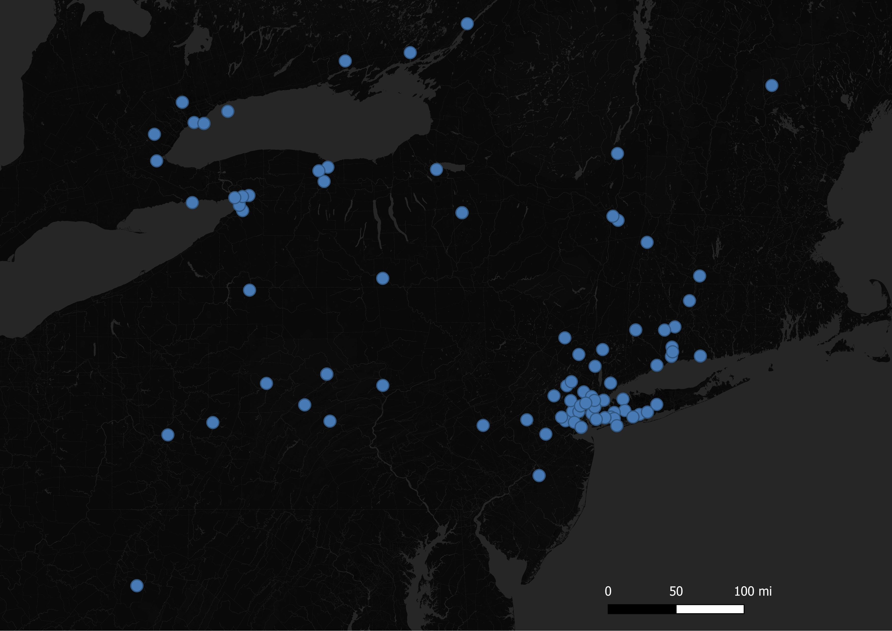

# Geo-Tagged Tweet Visualization of the New York Area

Using the Twitter API, I was able to collect nearly 200 geo-tagged tweets in the New York area over a period of 60 seconds. As you can see in the map above, there is a large cluster of tweets in New York City. This is not surprising considering it is the biggest city in the surounding area. It is also important to note that the 2020 NFL draft was happening at the time of the tweet collection. As a result of this there could have been an increase in activity on Twitter. It would be interesting to see how the map would change if the draft was not happening. 
